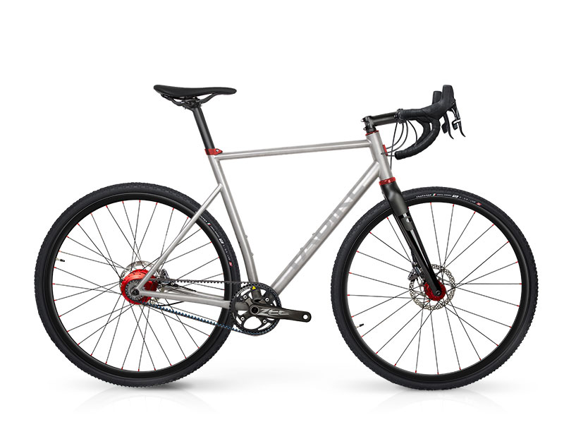

# FABIKE
## DESIGNED FOR EXPERIENCE

#### E-commerce website for a bicycle brand producing carbon fibre and titanium frames, selling them as well as fully assembled bicycles with high end components. (Full Stack project)

[FABIKE - Heroku link](website will be here)

************************************************************

************************************************************

## Table of Contents

1. [**UX**](#ux)
    - [**Goals**](#goals)
    - [**Strategy**](#strategy)
    - [**Scope**](#scope)
    - [**Structure**](#structure)
    - [**Skeleton**](#skeleton)
    - [**Surface**](#surface)

2. [**Information Architecture**](#information-architecture)
    - [**Database Choice**](#database-choice)
    - [**Data Modelling**](#data-modelling)

3. [**Features**](#features)
    - [**Existing Features**](#existing-features)
    - [**Features to be Implemented**](#features-to-be-implemented)

4. [**Technologies used**](#technologies-used)
    - [**Languages**](#languages)
    - [**Libraries and Frameworks**](#libraries-and-frameworks)
    - [**Tools**](#tools)
    - [**Databases**](#databases)

5. [**Testing**](#testing)

6. [**Deployment**](#deployment)
    - [**Local Deployment**](#local-deployment)
    - [**Heroku Deployment**](#heroku-deployment)

7. [**Credits**](#credits)
    - [**Content**](#content)
    - [**Images**](#images)
    - [**Code**](#code)
    - [**Acknowledgments**](#acknowledgments)

8. [**Disclaimer**](#disclaimer)  
---

## UX

### GOALS

Target audience:
- Cyckling enthusiast, semi- & professionals, who value high quality products for sports, who are very knowledgeable about the industry, and want to purchase a high end customizable frame or fully assembled bicyckle for their sports or recreational cyckling.

Main goal of this site: 
- Build a full cycle e-shop to present the brand's products to potential buyers, and enable the latter with an easy way to choose a product, get all necessary info about the products on the web or additional info by contacting the website's onwer, quickly and easily purchase one, or save it for buying later.

Organizational Goals:
- Present products in way to make a purchase easy
- Enable convenient & quick way of buying products via its e-shop
- Sell frames & bicyckles
- Promote & provide educational support on how to service and take care of bicicles
- Strengthen the brand's image

User Goals:
- Browse through products & get all necessary info about them, and all related info (e.g., components, shipping)
- Quickly and easily purchase a product
- Get answers from the producers in case any 
- Attend educational workshops

##### back to [top](#table-of-contents)