# FABIKE - Testing
## High-end bicycle & frames e-shop - Testing
#### Full Stack Project - Testing write-up

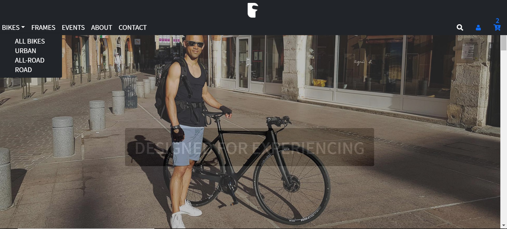

This document is intended to record testing at various stages of development of the project, as well as different functions, functionalities, correct display of the project's page, etc. 

[Main README.md file](README.md)

## FABIKE e-shop

## Table of Contents
1. [**Automated Testing**](#automated-testing)
    - [**Validation services**](#validation-services)
2. [**Manual Testing**](#manual-testing)
    - [**Responsiveness**](#responsiveness)
    - [**Client Stories Testing**](#client-stories-testing)
3. [**Bugs discovered**](#bugs-discovered)
    - [**Solved bugs**](#solved-bugs)
    - [**Unsolved bugs**](#unsolved-bugs)
4. [**Further Testing**](#further-testing)


## Automated Testing

Tests were implemented to provide addtional testing capabilities and ensure that the application works correctly. 
Unit test can be found in respective app directories: `test_views.py`,  `test_forms.py`, `test_models.py`. 
Note: The tests should be added in local database, as The Heroku hobby-tier does not give permissions to allow creation of databases that are required for python automated testing. To run the test and check the output, the database (Postgres) code configuration in settings.py should be temporarily removed or commented out.

You can run tests in Gitpod or other IDE using this command `python3 manage.py test`

### Travis

Travis testing was integrated into the project to ensure integrity of the deployed site.
You can find details in `.travis.yml`.


### Validation services
The following validation services were used to check the validity of the website code.
- [W3C Markup Validation]( https://validator.w3.org/): 
    - All pages except `Add Product` & `Edit Product` have no errors or warning:

    | [HOME](media/readme/validation/home_html.jpg) | [BIKES](media/readme/validation/bikes_html.jpg) |[URBAN](media/readme/validation/urban_html.jpg) | [ALL ROAD](media/readme/validation/all_road_html.jpg) | [ROAD](media/readme/validation/road_html.jpg) | [FRAMES](media/readme/validation/frames_html.jpg) | [PRODUCT BIKE](media/readme/validation/product_bike_html.jpg) | 
    [PRODUCT FRAME](media/readme/validation/product_frame_html.jpg) | [PRODUCT SEARCH](media/readme/validation/product_search_html.jpg) | [EVENTS](media/readme/validation/events_html.jpg) | [EVENT](media/readme/validation/event_html.jpg) | [ADD EVENT](media/readme/validation/add_event_html.jpg)| 
    [EDIT EVENT](media/readme/validation/edit_event_html.jpg) | [ABOUT](media/readme/validation/about_html.jpg) | [CONTACT](media/readme/validation/contact_html.jpg)| 
    [CART](media/readme/validation/cart_html.jpg) | [CHECKOUT](media/readme/validation/checkout_html.jpg) | [CHECKOUT Success](media/readme/validation/checkout__success_html.jpg) | [PROFILE](media/readme/validation/profile_html.jpg) | 
    [UNDER CONSTRUCTION](media/readme/validation/under_construction_html.jpg)| 

    - `Add Product` & `Edit Product` produce 6 errors each due to repeated IDs. This is caused by code from widgets of Uploading images for products in product management. I copied the code of the widget from Boutique Ado repository. Considering these errors are not critical, and due to lack of time, I leave the code as it is.
    * [ADD PRODUCT](media/readme/validation/add_product_html.jpg)


- [W3C CSS validation](https://jigsaw.w3.org/css-validator/):
    Checked all css files and no errors found.
    * [base.css](media/readme/validation/base_css.jpg)
    * [cart.css](media/readme/validation/cart_css.jpg)
    * [checkout.css](media/readme/validation/checkout_css.jpg)
    * [home.css](media/readme/validation/home_css.jpg)
    * [profile.css](media/readme/validation/profile_css.jpg)
    * [product.css](media/readme/validation/product_css.jpg)

- [JSHint](https://jshint.com/) & [Esprima](https://esprima.org/demo/validate.html):
    - Some warnings about 'template literal syntax' and undefined variable $. 
    - One error, which I have not managed to fix:
```
- File home.js triggers an error on line 15: missing semicolon. 
    If I add a semicolon, I get 2 errors: 
    - 15: missing semicolon.
    - 15: Unnecessary semicolon.

```

- [PEP8 Python Validator](http://pep8online.com):
    - No errors.
    - Left a couple of long line where it was not logical to break it.

- Console errors:
No errors.


## Manual Testing

### Responsiveness
I have tested responsiveness of the website for various mobile, pad, laptop & desktop sized screens on:
- Google Chrome Devtools 
- [Responsive Checker](https://www.websiteplanet.com/webtools/responsive-checker/). 


### Client Stories Testing
The user stories are described in the UX section of [README.md](README.md) 


- **First time website visitor**:

User story: I want to get a clear idea what the website is about

    Testing: 
    - Open the home page, scroll it down 
    
    Results: 
    - Hero image slide shows featuring bicycles. 
    - Navbar menu contains "Bikes" & "Frames", as well as  "About" links. 
    - Scrolling down revels images with info and additional access buttons to urban, all-road, road bikes scetions.
    - Additionally you can info about brands the company works with. 
    - The footer contains additional links to Bikes, Frames, About, etc.

    Conclusion:
    - Passed. A visitor can easily understand what the website is about, as well as see the main navigation units allowing to continue exploring the website.
    

******************

User story: I want to be able to easily see where I can find various info (menu, sections, links, individual pages/windows) and easily navigate there

    Testing: 
    - Located the Navbar, and clicked all of the links there: 
            1. Bikes>All Bikes/Urban/All Road/Road
            2. Frames
            3. Events
            4. About
            5. Contact
    - Clicked Search icon
    - Clicked Profile icon
    - Clicked Cart icon
    - Scrolled down and clicked Discover buttons for each of the sections Urban, All Road, Road
    - Located the footer and clicked Bikes, Frames, Events, About, Warranty Policy, Returns & Refunds, as well as social media icons - Facebook & Instagram, and finally email icon. 

    Results: 
    - The navbar has all the necessary links for a visitor to explore the website. Clicking each individual link leads a user to a respective part of the website, eg. clicking Bikes>Urban will open a page with all the bikes categorized as urban; or clicking Frames takes user to a page with frames listed, and so on. 
    - Search icon opens a search window, where a user can type search parameters. 
    - Profile icon opens menu with two options: SIGN UP & SIGN IN (not-logged in view)
    - Cart icon leads to an empty cart page. 
    - All the links in the footer lead to respective pages, except Warranty Policy, Returns & Refunds, which both lead to Under Construction page. 
    - Facebook and Instagram open social media accounts. 
    - Email icon leads to Contact Us page. 

    Conclusion: 
    - Passed. All links work as expected. There no wrong or broken links. 

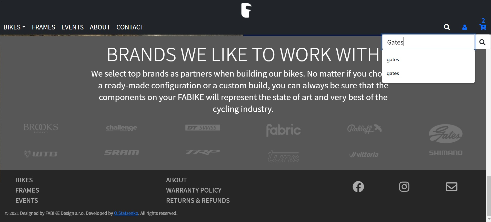
******************

User story: Find appropriate section - bikes or frames, urban bikes or all road bikes, etc, and be able to see all the products in the section

    Testing:
    - Click links Bikes>All Bikes/Urban/All Road/Road, Frames or Events
    - Scroll down and click Discover buttons for Urban, All Road or Road section
    - Click links in the footer for Bikes, Frames, Events

    Results:
    - All links open respective pages - Bikes, Frames or Events from either navbar, or Discover buttons in the body of the home page, or the footer.
    - Bikes shows all three groupd of bikes in one page: Urban, All Road, Road, and allows a visitor to easily navigate either to a specific section, eg Urban or to an individual bike.
    - Frames shows both frames currently on offer, carbon fiber and titanium, and allows navigating to either of them.
    - Events lists all upcoming events, indicating info about topic and date/time. A user can easily navigate to an individual event page to get more info or book a spot.
    - A user can always see the navbar menu, no matter where on the website one currently is, and can navigate back to any of the pages of interest. 

    Conclusion: 
    - Passed. The website offers several options from where users can reach respective sections of interest, bikes, frames or events.

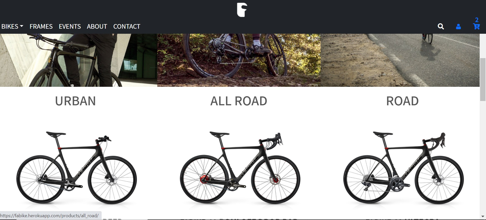
**** 
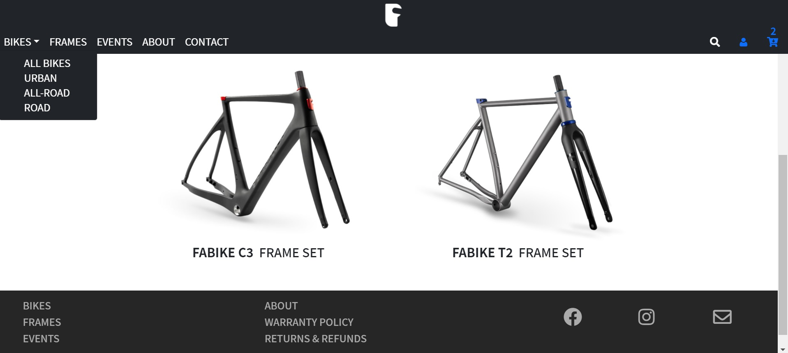
******************

User story: Choose an individual product, and get all necessary info: images, descriptions, technical parameters, price, delivery terms, etc. 

    Testing:
    - Open any bike section(all bikes, urban, all road or road bikes) and click an individual product
    - Open frames and click one of the frames
    - Open events page and click More info on one of the events
    - Typed some search words into the search field

    Results:
    - An individual bicycle page contains all the necessary info about the product.
    - Image, name, frame name, clickable color/size/components options, price and weight, list of components, info about geometry of the frames and sizes relative to a person's height. 
    - It includes production and delivery info. 
    - An individual frame page contains the same info as a bicycle page, except of the components. 
    - An event page has info about the topic, what attendees will learn during a workshop, price, time and date, location, and a button to contact the company to book a spot for an attendee.
    
    Conclusion:
    - Passed. All individual pages work as expected, and display necessary info for a visitor of the website to make a decsion of next steps from such a page, and provides necessary tools to continue. 

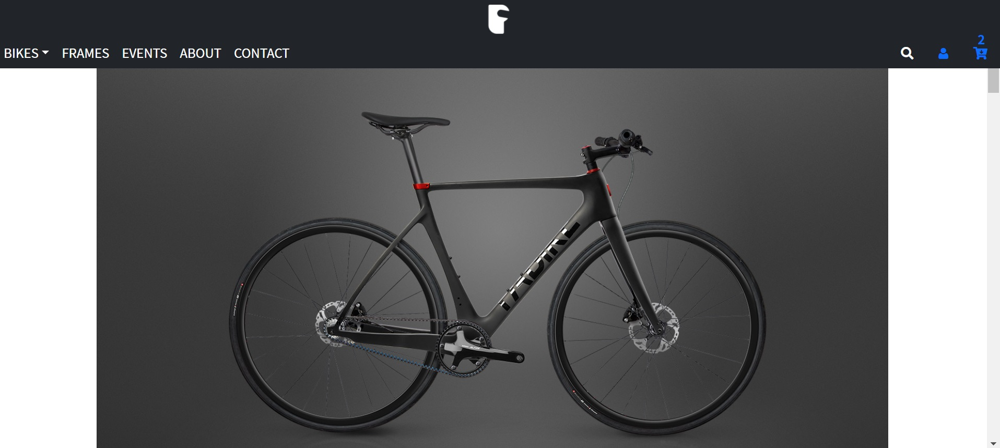
**** 
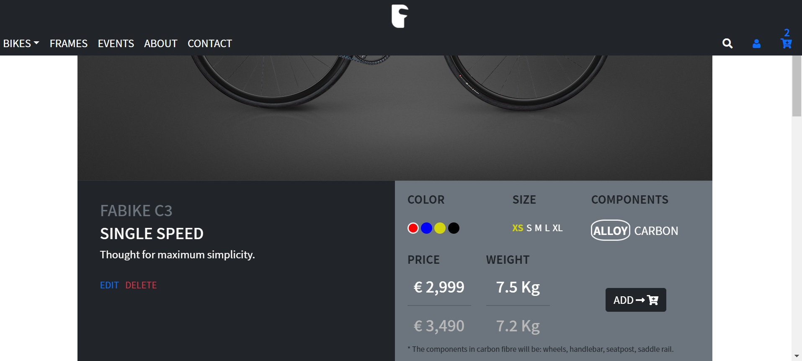
****
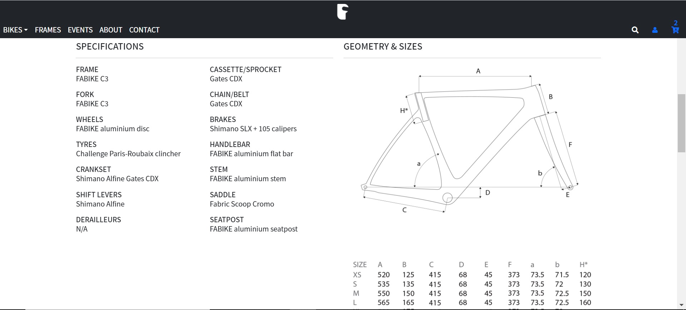
****

******************

User story: I want to be able to choose appropriate size, color and add the product to shopping cart

    Testing: 
    - Click & choose individual parameters of a product - color, size, components
    - Click Add to Cart button
    - Click Shopping Cart 

    Results: 
    - All of the selectors work correctly responding to click, change of components also highlights respective price and weight of a product, depending where carbon fiber or alloy components are chosen. 
    - Clicking Add to Cart add a product to the cart. I get a confirmation message. Also can see the change of the color of the cart icon and number of products added.  
    - Shopping Cart icon takes me to the shopping cart page, where I can see info about products added. 
    Conclusion:
    - Passed. All the functionality works as planned and provides necessary feedback to a user. 

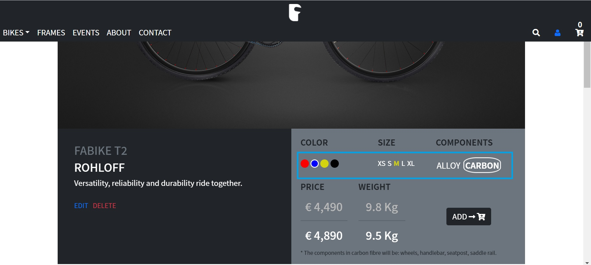
****
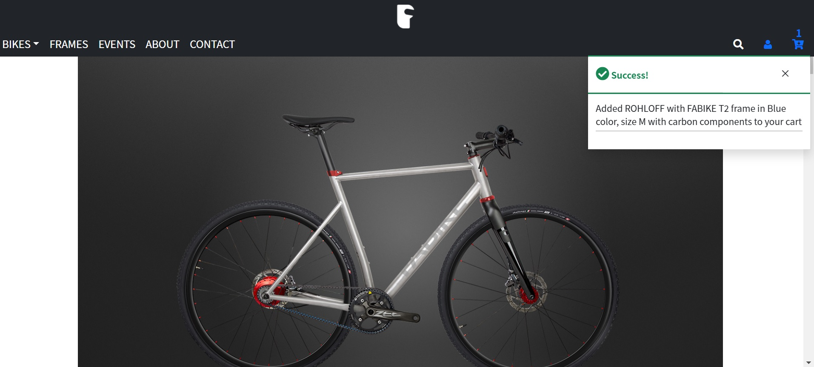
******************

User story: I want to be able to easily navigate from the shopping cart back to products

    Testing: 
    - Click Back to Bikes button
    - Click links in the navbar
    Results: 
    - Back to Bikes takes me back to all the bicycles displayed together, and I can see more options
    - Using navbar menu takes me to Bikes, Frames or Events pages
    Conclusion:
    - Passed. Works as planned, a user can easily navigate back to explore more products, using several options.  

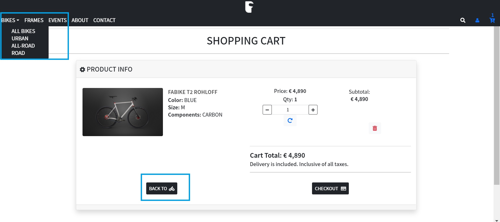
******************

User story: Then once I am done with products, I want to be able to easily find the shopping cart, and navigate there

    Testing: 
    - Location Shopping cart icon and click it
    Results: 
    - The icon is easily and always visible in the upper right corner
    - It has blue color and displays a number of products added
    - Clicking it opens the shopping cart page, displaying all the necessary info about product
    - A user can update quantity of a product or delete a product from a shopping cart, a message is provided to a user upon each action
    - If the cart is empty it displays a message that it is empty and has a button Back to Bikes
    - If all products deleted, the icon becomes white and displays zero
    Conclusion:
    - Passed. Works as expected. 

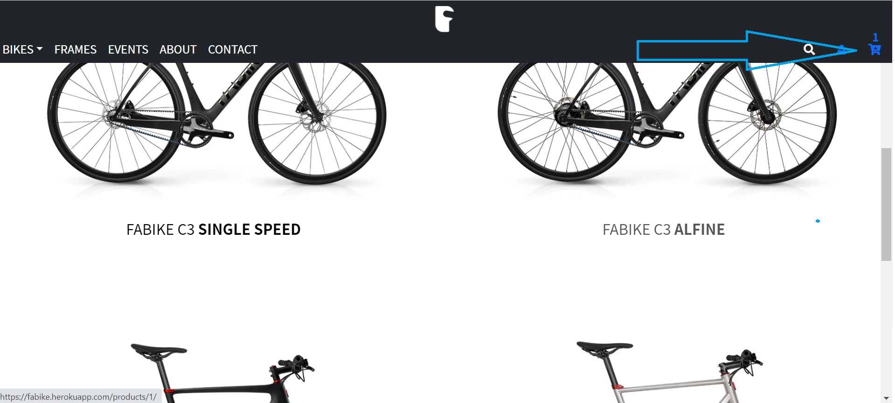
******************


User story: I want to be able to go to checkout, see all the info about my purchase, be able to add billing/shipping details, add my card details, and pay with one-click

    Testing: 
    - Click Checkout button from the cart
    - Check Checkout Summary
    - Add my billing/shipping details
    - Enter card info and press Complete Order

    Results: 
    - It takes me to checkout page as expected
    - The summary shows the product details: model, color, size, components, quantity, price, delivery cost, final sum to pay
    - It displays a form for billing and shipping details, which a user can fill in
    - Beneath the form there is an option to Sign Up or Sign In
    - Payment info field for card info
    - a user can choose buttons Back to Cart & Complete order
    - A user can see a message, informing how much an entered card will be charged

    Conclusion:
    - Passed.
    - I can see all the necessary info about my order
    - The form does not let to proceed unless all the necessary fields are filled in
    - Pressing Sign Up takes me to create an account
    - If card details are incomplete or missing, a relevant message is displayed, and an order cannot be paid

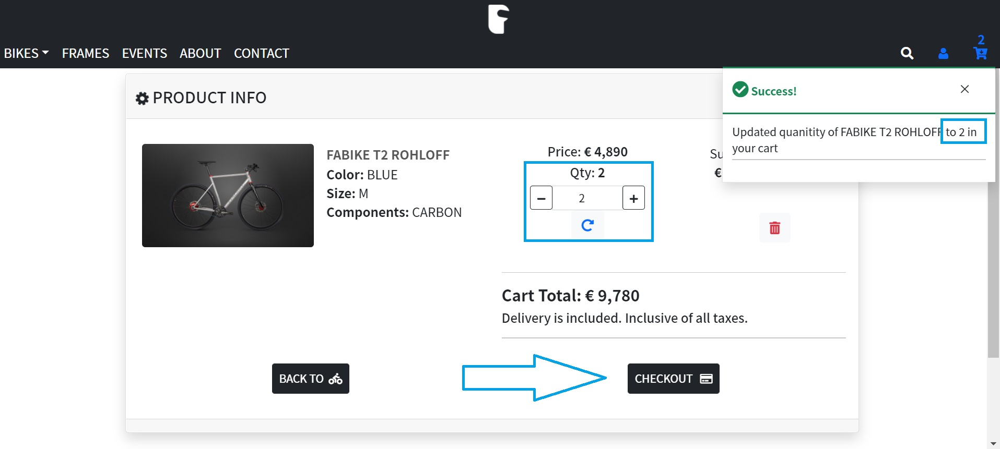
****
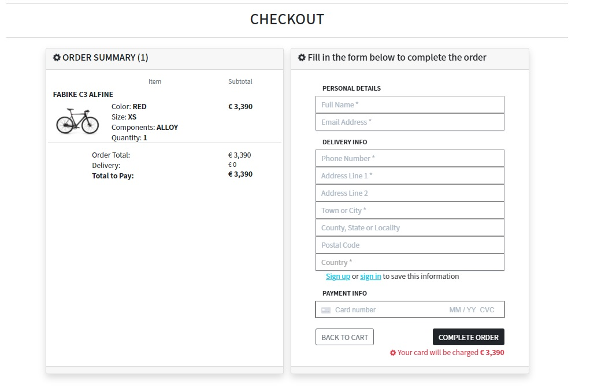
****
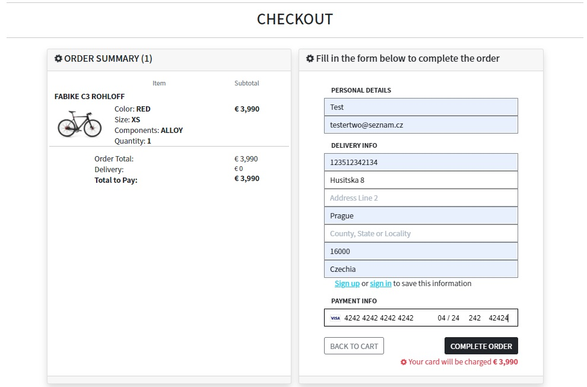
****
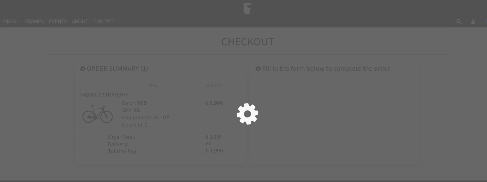
****

Checkout success page:
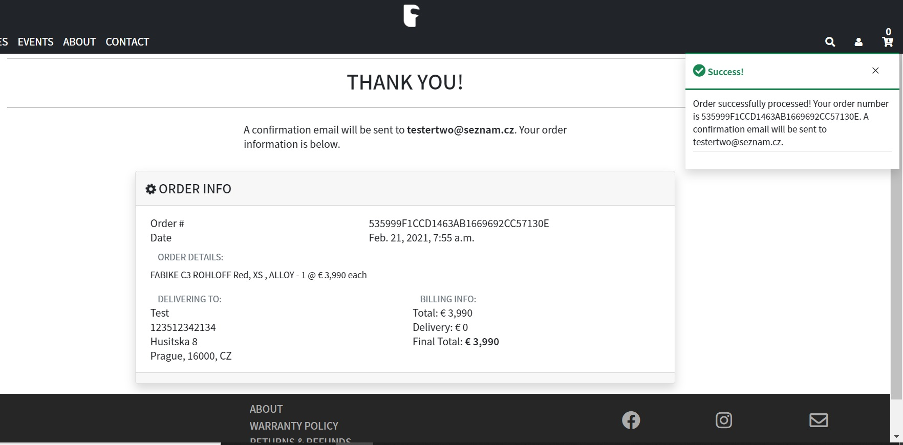
****

Confirmation email:
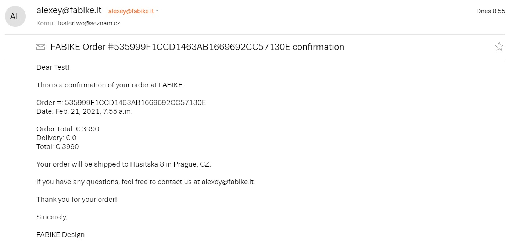
****

Stripe webhooks report:
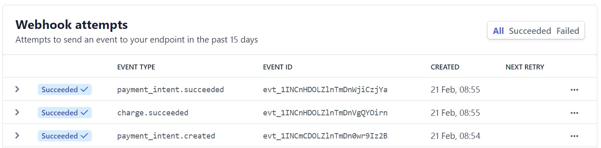
******************


User story: Also I want to be able to automatically (during checkout-payment process) add my details and automatically create an account (adding all my data, incl. shipping address)

    Testing: 
    - Clicking Sign Up under the form to create an account

    Results: 
    - It takes me to create an account. 
    - Once an account is created and I navigate back to checkout I can save billing and shipping info into my account automatically
    - I get a confirmation message that I signed in as "user name"

    Conclusion:
    - Passed. All works as expected

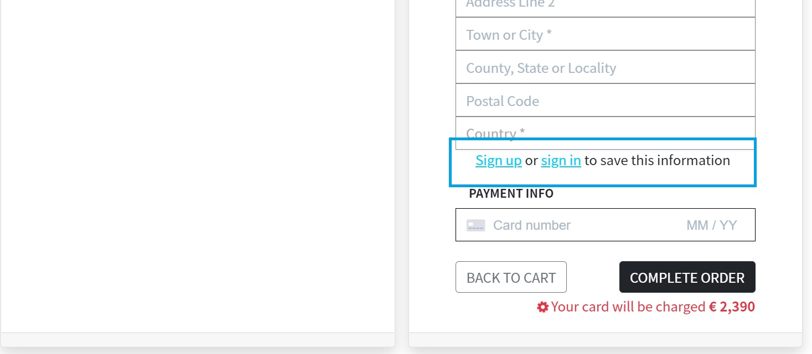
****
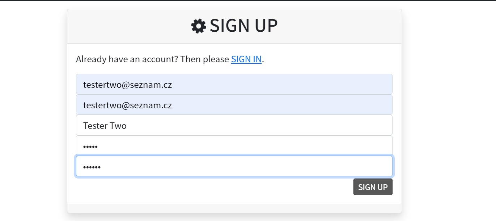
****
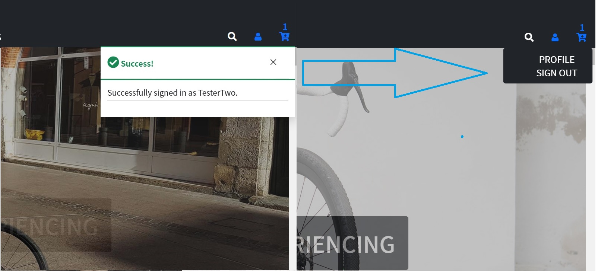
******************

User story: Once the payment is processed, I want to get a confirmation email about the payment, and the order, with all the order details. And be able to login into my account and see the order there.

    Testing: 
    - I get to order success summary page
    - i check my email    
    - I click Profile Icon and choose Profile
    - I update my info
    - i check purchase history and open a past order

    Results: 
    - Once checkout process is successful I get a message about an order
    - Then I am taken to a summary page with all the info of an order, saying that all the info will be sent to my email
    - I get an email with confirmation of my order
    - I can open my profile, where I can see my shipping details
    - I update them and get a success message
    - I can see my purchse history, and can open last orders details
    - I open a past order, which takes me to a page with the order summary: order number/date, product details, shipping address, payment info. 

    Conclusion:
    - Passed.
    - All works as expected.
    - Admin has a corect order created.

Confirmation email:

****
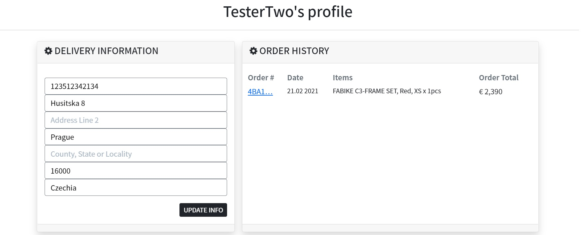
****
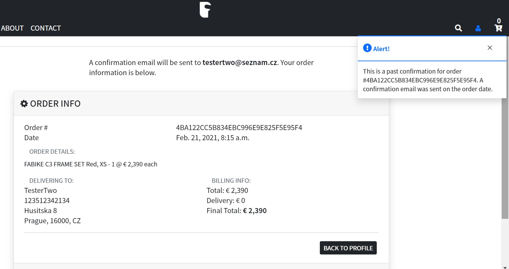
******************


User story: If I don’t purchase anything, I want to be able to create an account, add my details, and add products to my wish list

    Note: Feature was removed from the current implementation due to time constraints, and postponed for further stages of the project development. 
    

User story: If I decide not to create an account, I want to have an option to send a message or ask questions about the products

    Testing: 
    - Navigate to contact page
    - Send a message

    Results: 
    - I am taken to a contact us form
    - I fill it in, and send
    - I get a confirmation that my message was sent successfully

    Conclusion:
    - Passed. 
    - The contact form works as expected, does not allow a message with any field empty
    - I checked my email, a message was received

    Bug: 
    - Subject is missing in the message. 
    Fixed: 
    - Updated code in views.py of the contact app

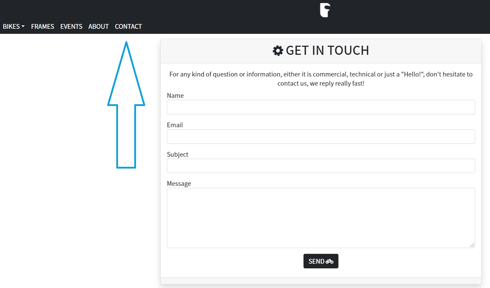
******************

##### back to [top](#table-of-contents)


- **Returning visitor** (in addition to possibilities described above, except those specific to first time visitors):


User story: If I haven’t created a profile yet, to find easily where I can do that, and create one
    
    Testing: 
    - Re-open the website and locate the profile icon
    - Click the profile icon
    - Choose Sign Up from the menu
    - Create an account

    Results: 
    - Profile icon is easily visible
    - Clicking it opens a menu where I choose Sign Up
    - On Sing Up page I will in a form 
    - I am taken to Sign In page

    Conclusion:
    - Passed. Easy to find where and how to create an account, and sign in

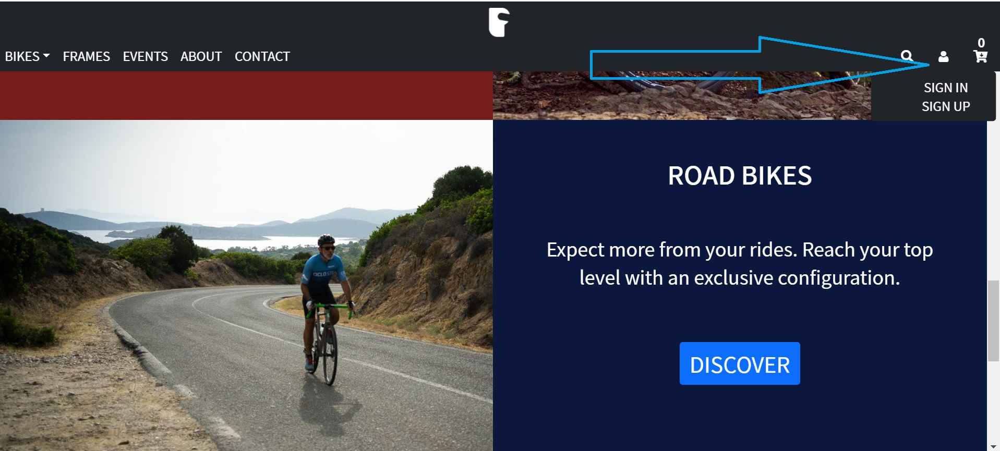
******************

User story: I want to be able to login into my account, update my data if needed
    
    Testing: 
    - Sign In and navigate to Profile
    - Update my info
    Results: 
    - I sign in, and choose Profile in the menu
    - My profile is opened
    - I update my info and get a confirmation message
    Note: Whishlist functionality was removed from this stage of implementation. 

    Conclusion:
    - Passed. Works as expected.


******************

User story: I want to be able to navigate across the website and get info necessary for me to decide about a purchase and purchase a product taking steps described above
    
    Testing: 
    - I navigate to different parts of the website

    Results: 
    - Works as described in tested user stories above

    Conclusion:
    - Passed. 

##### back to [top](#table-of-contents)


- **Website administrator**:

User story: To have access to all the necessary data to manage products’ display on the web-site, customers’ accounts, and purchase histories, etc. 

    Testing: 
    - Login into admin using superuser credentials

    Results: 
    - I have full access to all the info stored in DB
    - I can manage groups and users of the website, and their access rights
    - I can add, update, delete products & events
    - I can check orders, update or delete them

    Conclusion:
    - Passed. Works as expected.


******************

User story: Admin CRUD - be able to easily login and navigate within the admin area of the website
    
    Testing: 
    - Logged in into admin
    
    Results: 
    - Checked accounts, where I can update or verify emails
    - Checked users, where I can add, delete a user, or update their access rights
    - Checked orders, updated an order, changed quantity
    - Checked events, updated an event
    - Checked products, updated a product

    Conclusion:
    - Passed. Works as expected.

User story: Admin CRUD - be able to easily add, modify or delete products listings, with all the necessary info – images, descriptions, technical parameters, etc.

    Testing: 
    - Sing In as a super user or staff user
    - Add a new product
    - Update a product
    - Delete a product
    - Add a new event
    - Update an event
    - Delete an event

    Results: 
    - I click on Profile icon in the navbar and choose either New Product or New Event
    - I added a new product, including pictures
    - I opened a page of a newly added product, pressed edit
    - I edited a product and saved info, including pictures
    - I deleted this newly created product 
    - I get notification at each step
    - I added a new event
    - I opened a page of a newly added event, pressed edit
    - I edited a product and saved info
    - I deleted this newly created event 
    - I get notification at each step

    Conclusion: 
    - Passed.
    - Works as expected. Provides all the necessary tools for an admin to manage products, events, etc. 

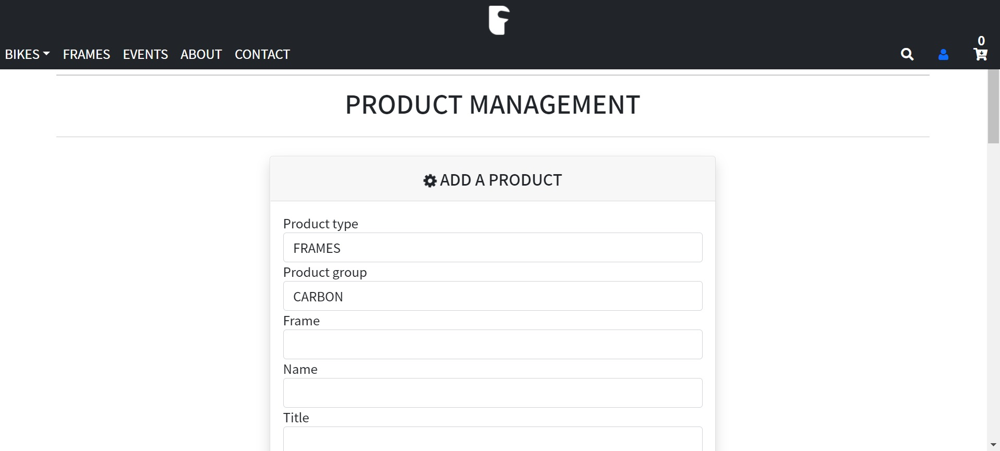
****
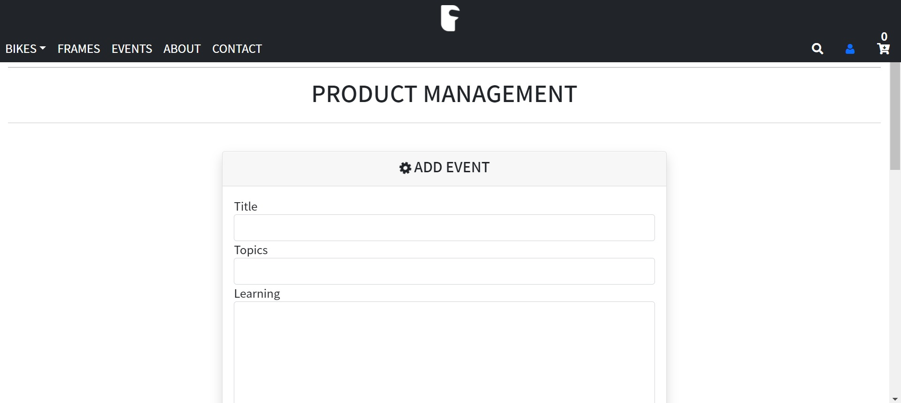
****
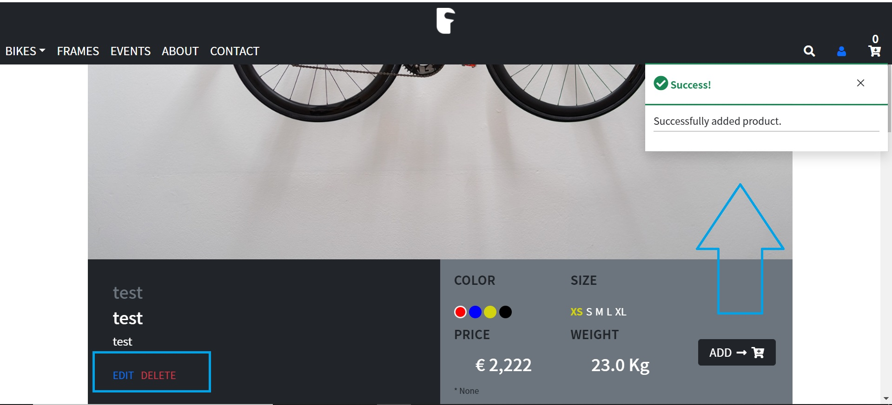
****
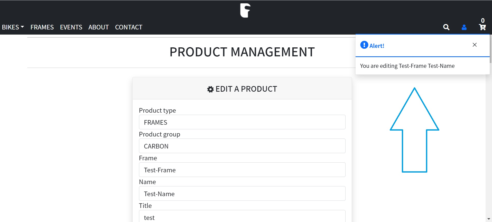
****
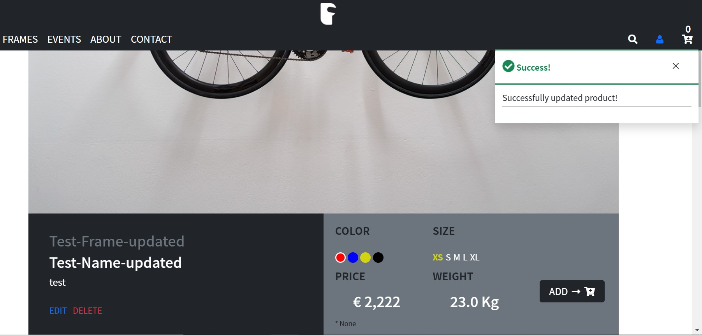
****
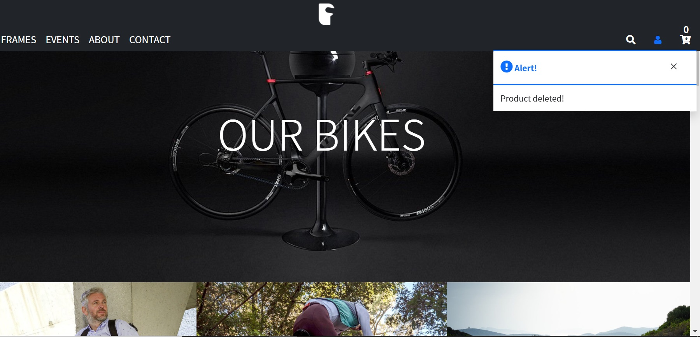
****
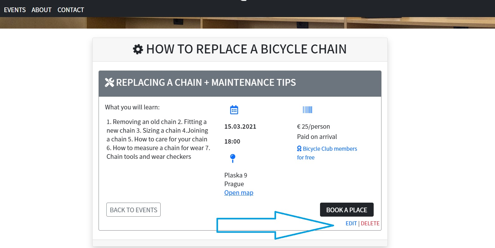
****
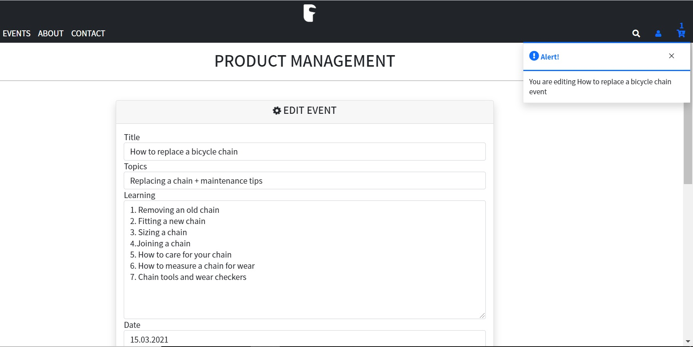
****
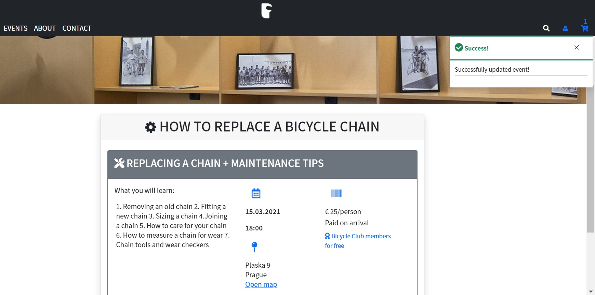
****
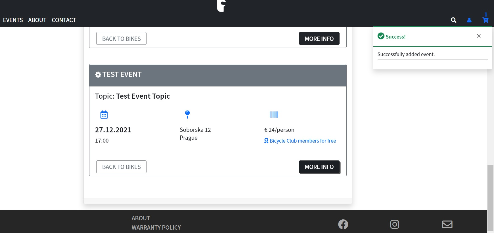
****
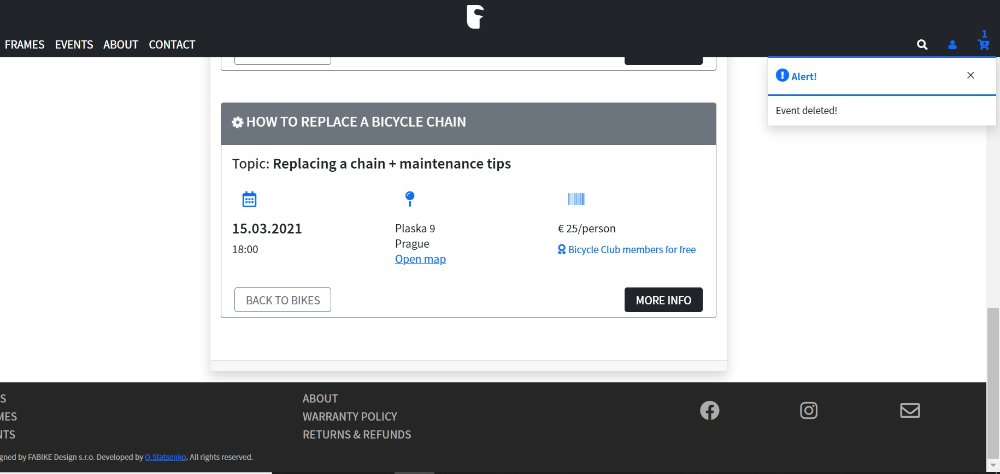
******************


## BUGS DISCOVERED
### SOLVED BUGS

Bug: 
- On Heroku getting 500 error upon pressing Checkout button, while it works from Gitpod.
Solution: 
- Added Stripe public, secret, & wh keys to heroku.
Solved

Bug: 
- Stripe webhooks don't work.
Solution: 
- Added Stripe public, secret, & wh keys to heroku.
Solved.

Bug: 
- Checkout works well, an order is created, but a confirmation email is not sent. Tried both signed-in purchase, and non signed-in purchase. 
Solution: 
- Updated secret keys on heroku.
Solved.

Bug: 
- Checkout works, and gives a toast message, an email is sent. But two orders are created with two different numbers. First order number is shown in a toast message, and this order is created without current cart data & stripe pid.
- Second order number is indicated in a confirmation email, and this 2nd order has both current cart data & stripe pid.
- Webhooks events are registered correctly on stripe. But I get a 500 error, if I send a webhook test for payment_intent.succeded.
Solution: 
- Added a couple of missing lines of code in webhooks_handler.py (lines 41-45). 
Solved: 
- Now one order is created, it has cart data + stripe pid in DB, a confirmation email is sent with a correct order number, strip registers all three events as succeded: payment_intent.created, payment_intent.succeded, charge.succeeded.

Bug: 
- Current images are not displayed correctly in Product management edit a product form.
Solution: 
- Moved all the product images from static/img to media, updated all the image links.
Solved: 
- Works as it should

Bug: 
- Getting errors and the message that "cannot concatenate str and int" after adding product to the cart, updating its quantity, and then adding the same product to the cart.
Solution: 
- Updated this line in def update_cart: quantity = int(request.POST.get('quantity')). The error was coming upon adding a product to a cart, where quantity was added to cart as int, then updating its quantity in the cart, after which the quantity got converted into a string, and so it was not possible to add to the cart. 
Solved: 
- Works as it should

Bug: 
- Seatpost Diameter in Frame product was displayed as None
Solution: 
- Changed {{ product.seatpost }} to {{ product.seatpost_diameter }} in product.html
Solved: 
- Works as it should

### UNSOLVED BUGS

Bug: 
- When testing webhook 'payment_intent.succeded' get 'POST /checkout/wh/ HTTP/1.1" 500 135356' & 'AttributeError: cart'
Solution: 

- Compared the code to the original source in Boutique Ado project.
- Printed cart from different places througout views.py, context.py, webhooks_handler.py in cart and checkout apps. Everytime printed a correct cart
- Went through checkout process many times.
- Checked correctness of the process - everything matches:
    - Checkout success page with order info
    - Confirmation email
    - Order checked via /admin access has striped pid and correct cart
    - Stripe report give me three succeded reports


Not solved. Cannot find the reason why the testing does not work.


## FURTHER Testing
Asked friends and family to look at the site on their devices & report any issues they found.

